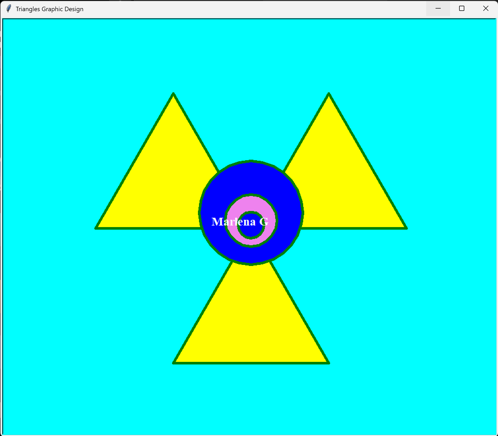

# 🔺 Triangles — Turtle Graphic Design

A Python turtle graphics program that draws three overlapping yellow
triangles with concentric blue and violet circles in the center and a
name label on a cyan background.

---

## 📋 Features

- Draws three overlapping equilateral triangles filled with yellow
- Draws three concentric circles (blue, violet, blue) in the center
- Writes a name label in white bold text
- Cyan background with green pen
- Uses helper functions for triangles and circles

---

## ⚙️ How It Works

1. Three overlapping yellow triangles are drawn
2. Three concentric circles are drawn in the center
3. A white name label is written on the canvas

---

## 🛠️ Technologies Used

| Technology      | Purpose                                        |
|-----------------|------------------------------------------------|
| Python 3.14     | Core programming language                      |
| `turtle`        | Drawing the graphic design                     |
| `begin_fill()`  | Filling shapes with color                      |
| `goto()`        | Positioning turtle at specific coordinates     |
| Functions       | `draw_triangle()` and `draw_circle()` helpers  |

---

## 🎓 Learning Outcomes

- Drawing equilateral triangles using 120-degree turns
- Drawing concentric circles with different radii and colors
- Using `write()` to add text labels to the canvas
- Organizing repeated drawing logic into reusable functions

---

## 📁 Folder Structure

```
A2-Triangles-Design/
├── Fabrick_Marlena_A2_Triangles.py
├── triangles-finished.png
├── .gitignore
├── LICENSE
└── README.md
```

---

## 🚀 How to Run

```bash
python Fabrick_Marlena_A2_Triangles.py
```

---

## 📸 Screenshots

### Finished Design



---

## 👩‍💻 Author

**Marlena Fabrick** — Python turtle graphics student project
